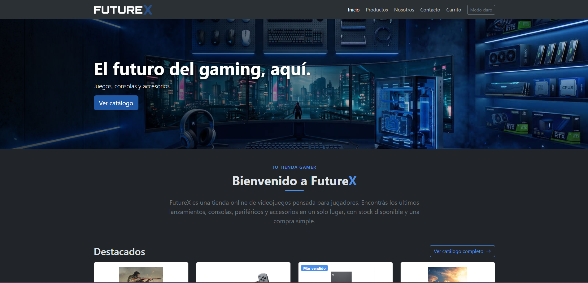
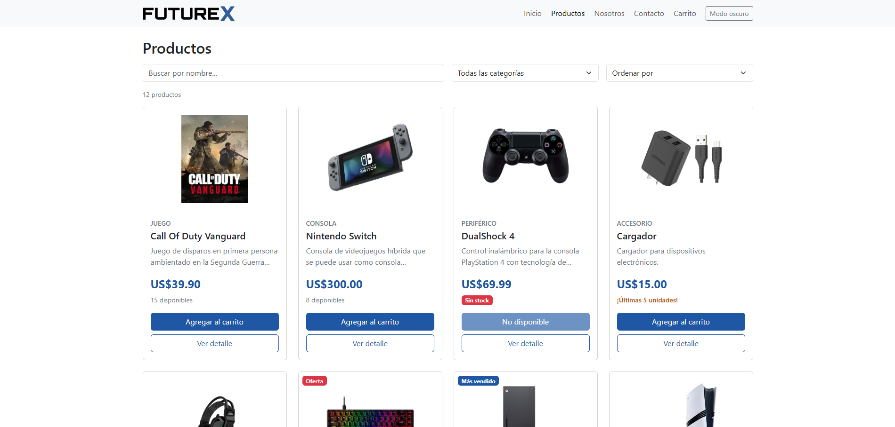
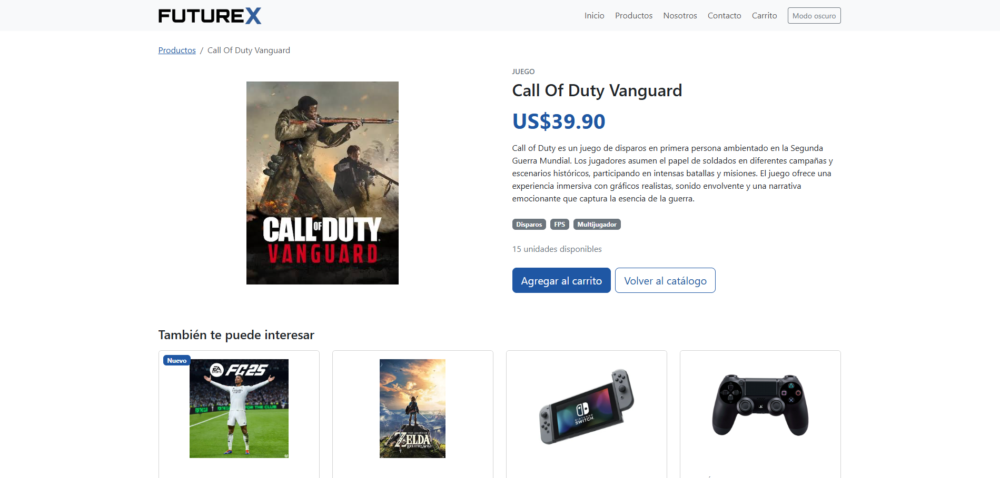
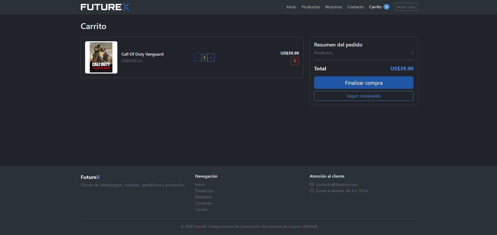
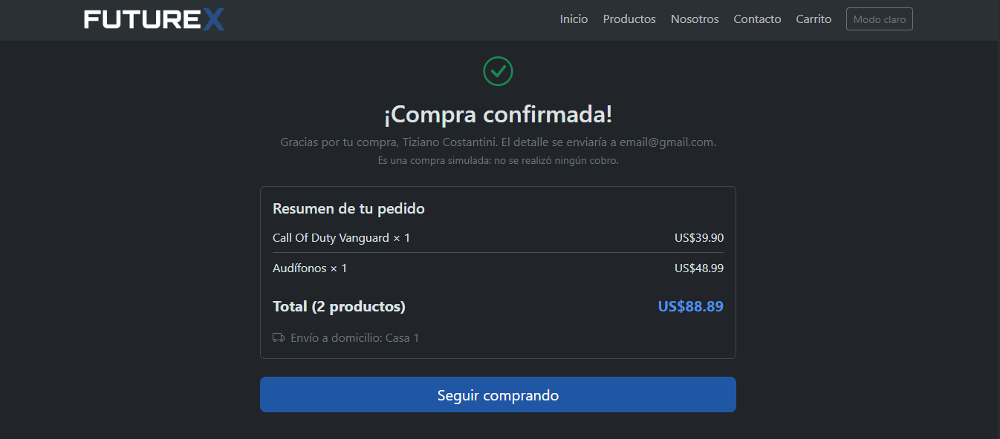

# FutureX | Tienda online de videojuegos

Aplicación web en React que simula una tienda online de videojuegos, consolas, periféricos y accesorios. Permite explorar el catálogo, buscar, filtrar y ordenar productos, ver el detalle de cada uno, armar un carrito y completar una compra simulada.

Trabajo práctico de la materia **Construcción de Interfaces de Usuario** (Licenciatura en Informática, UNAHUR).

🔗 **Deploy:** _https://trabajo-practico-ten.vercel.app/_

## Capturas

| Inicio (modo oscuro) | Catálogo (modo claro) |
|---|---|
|  |  |

| Detalle de producto | Carrito |
|---|---|
|  |  |

| Compra confirmada |
|---|
|  |

## Funcionalidades

- **Inicio:** banner con la identidad de la tienda, descripción, productos destacados y acceso al catálogo.
- **Catálogo:** 12 productos cargados desde un array de objetos. Cada tarjeta muestra imagen, categoría, precio, descripción, stock y botones de detalle y agregar al carrito. Sin stock, el botón de agregar queda deshabilitado y se indica "Sin stock".
- **Buscador, filtro y orden:** búsqueda por nombre, filtro por categoría y orden por precio (menor a mayor y mayor a menor).
- **Detalle de producto:** ruta dinámica `/producto/:id`, con descripción completa, características, productos relacionados y mensaje si el producto no existe.
- **Carrito:** aumentar y disminuir cantidades (sin superar el stock), eliminar productos, subtotal por producto, total general y cantidad total. El carrito se guarda en `localStorage`.
- **Finalizar compra:** formulario controlado con validaciones (nombre, email, teléfono y dirección), bloqueo con el carrito vacío y pantalla de confirmación con el resumen del pedido.
- **Contacto y Nosotros:** formulario de consulta con validaciones, preguntas frecuentes y presentación de la tienda.
- **Modo claro y oscuro**, recordado entre visitas.
- **Diseño responsive** para celular, tablet y escritorio.

## Tecnologías utilizadas

- [React](https://react.dev/) 19, con componentes funcionales y hooks (`useState`, `useEffect`, `useParams`, `useLocation`)
- [Vite](https://vite.dev/) como herramienta de desarrollo y construcción
- [React Router DOM](https://reactrouter.com/) 7 para la navegación
- [Bootstrap](https://getbootstrap.com/) 5.3 para la grilla y los componentes, más CSS propio en `src/index.css` para la identidad visual
- [Bootstrap Icons](https://icons.getbootstrap.com/)
- ESLint
- `localStorage` para persistir el carrito y el tema

## Instalación y ejecución

Requisitos: [Node.js](https://nodejs.org/) (versión LTS reciente) y npm.

```bash
# 1. Clonar el repositorio
git clone https://github.com/Tizi01-source/Trabajo_Practico.git
cd Trabajo_Practico

# 2. Instalar las dependencias
npm install

# 3. Iniciar el servidor de desarrollo
npm run dev
```

Después abrí en el navegador la dirección que muestra la terminal (normalmente `http://localhost:5173`).

Para generar la versión de producción: `npm run build`. Para probarla localmente: `npm run preview`.

## Estructura del proyecto

```
src/
├── components/        Componentes reutilizables
│   ├── Aviso.jsx
│   ├── CarritoItem.jsx
│   ├── Footer.jsx
│   ├── Navbar.jsx
│   ├── ProductoCard.jsx
│   └── ScrollToTop.jsx
├── pages/             Una página por ruta
│   ├── Carrito.jsx
│   ├── Contacto.jsx
│   ├── DetalleProducto.jsx
│   ├── FinalizarCompra.jsx
│   ├── Inicio.jsx
│   ├── Nosotros.jsx
│   └── Productos.jsx
├── data/
│   └── productos.js   Catálogo de productos
├── App.jsx            Estado compartido (carrito, tema, avisos) y rutas
├── main.jsx           Punto de entrada
└── index.css          Estilos propios
```

El estado del carrito vive en `App.jsx`, que contiene a todas las páginas, y llega a cada una por props.

## Integrante

- **Tiziano Costantini Marquez**

## Aclaraciones

- La compra es **simulada**: no hay pagos reales ni backend, y el stock no se descuenta al confirmar.
- El banner y los logos fueron generados con inteligencia artificial (Gemini).
- Las imágenes de los productos fueron tomadas de internet y se usan únicamente con fines educativos.
- Los datos de contacto, el horario de atención y las políticas de envío y devolución son **ficticios**.
